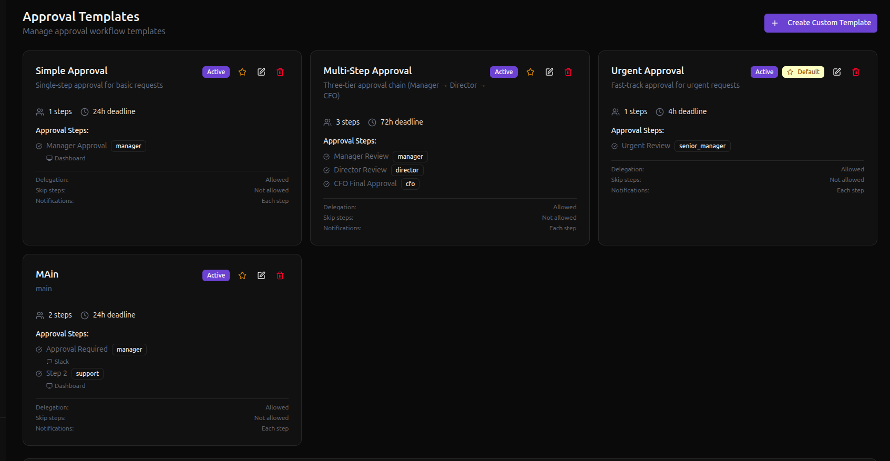
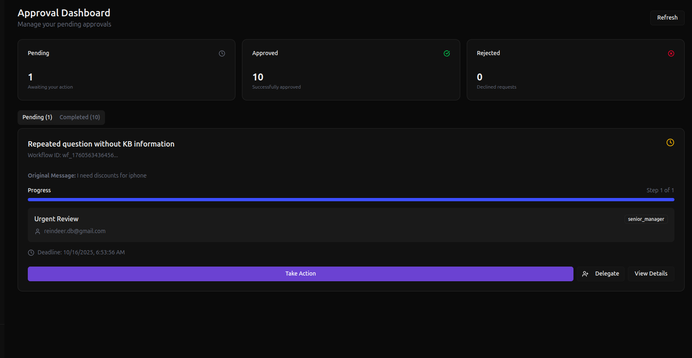

# 📚 FlowBot User Guide

*Your guide to using FlowBot's AI customer support with approval workflows*

---

## 🎯 Table of Contents

1. [Getting Started](#getting-started)
2. [Dashboard Overview](#dashboard-overview)
3. [Knowledge Base](#knowledge-base)
4. [Chat Widget](#chat-widget)
5. [Approval Workflows](#approval-workflows)
6. [Slack Integration](#slack-integration)
7. [Widget Customization](#widget-customization)
8. [API Reference](#api-reference)
9. [Troubleshooting](#troubleshooting)

---

## 🚀 Getting Started

### Installation & Setup

1. **Clone and Install**

   ```bash
   git clone https://github.com/anandukch/flowbot.git
   cd flowbot
   cd server && npm install
   cd ../client && npm install
   ```

2. **Environment Setup**

   ```bash
   cp server/.env.example server/.env
   # Configure: MongoDB, OpenAI/Groq API keys, Google OAuth
   ```

3. **Start Services**

   ```bash
   # Terminal 1 - Server
   cd server && npm run dev
   
   # Terminal 2 - Client Dashboard
   cd client && npm run dev
   ```

### First Access

- Dashboard: `http://localhost:3000`
- Server API: `http://localhost:3001`
- Login with Google OAuth

---

## 🏠 Dashboard Overview

### Main Sections

- **Knowledge Base**: Upload and manage your content files
- **Approvals**: Handle pending approval requests
- **Slack Config**: Set up Slack integration
- **Widget Customization**: Customize chat widget appearance

### User Profile

- View your agent ID (needed for widget integration)
- Manage account settings
- Access authentication tokens

---

## 📚 Knowledge Base

### How It Works

- **JSON Only**: Knowledge base accepts only JSON format content
- **Text Area Input**: Paste your JSON directly into the text area
- **No File Uploads**: There's no file upload feature - just copy/paste JSON

### Adding Knowledge Base Content

1. **Access Knowledge Base**
   - Navigate to "Knowledge Base" in dashboard
   - You'll see a large text area

2. **Add Your JSON**
   - Paste your JSON content into the text area
   - Use the sample JSON as a template
   - Click "Save Knowledge Base" to save

### JSON File Format

```json
{
  "products": {
    "iPhone": {
      "price": "$999",
      "features": ["Face ID", "A15 Chip", "Camera"],
      "warranty": "1 year"
    }
  },
  "policies": {
    "return_policy": "30 days return window",
    "shipping": "Free shipping over $50"
  }
}
```

### Text File Format

- Use clear sections and headings
- Include relevant keywords
- Structure as Q&A when possible
- Keep information concise and accurate

---

## 🌐 Chat Widget

### Basic Widget Setup

1. **Get Your Agent ID**
   - Login to dashboard
   - Copy your agent ID from profile section

2. **Add Widget to Website**

   ```html
   <script 
     src="http://localhost:3001/widget.js" 
     data-agent-id="your-agent-id">
   </script>
   ```

3. **Integration**
   - Paste before closing `</body>` tag
   - Widget appears automatically on your website
   - Replace `your-agent-id` with your actual agent ID

### Widget Features

- **Real-time Chat**: Instant messaging with AI
- **Approval Requests**: Automatic escalation when needed
- **Customizable Appearance**: Match your brand colors
- **Mobile Responsive**: Works on all devices

---

## 🔄 Approval Workflows

### How It Works

1. **Customer Request**: User asks for something requiring approval
2. **AI Detection**: System identifies approval-needed requests
3. **Workflow Creation**: Automatic approval workflow starts
4. **Notification**: Approvers get notified via Slack/Dashboard
5. **Decision**: Approve/Reject/Delegate the request
6. **Customer Update**: Real-time notification to customer

### Approval Dashboard

**Pending Approvals:**

- View all requests awaiting your decision
- See customer conversation context
- Quick approve/reject actions

**Completed Approvals:**

- History of processed requests
- Audit trail of decisions
- Response tracking

### Approval Actions

**Approve:**

1. Click "Approve" button
2. Add response message for customer
3. Submit approval

**Reject:**

1. Click "Reject" button
2. Provide rejection reason
3. Submit rejection

**Delegate:**

1. Click "Delegate" button
2. Enter colleague's email
3. Transfer responsibility

---

## 💬 Slack Integration

### Setup Requirements

1. **Slack App Creation**
   - Create app at [api.slack.com](https://api.slack.com/apps)
   - Get Bot User OAuth Token (starts with `xoxb-`)
   - Get App ID

2. **Configure in FlowBot**
   - Go to "Slack Config" in dashboard
   - Enter App ID and Bot Token
   - Save configuration

### Slack Features

**Interactive Approvals:**

- Receive approval requests as Slack messages
- Click buttons to approve/reject/delegate
- Modal forms for detailed responses

**Real-time Updates:**

- Instant notifications when approvals needed
- Status updates when decisions made
- Direct integration with your Slack workspace

---

## 🎨 Widget Customization

### Available Options

**Colors:**

- Primary color (main theme)
- Secondary color (accents)
- Background color
- Text color

**Layout:**

- Widget position (bottom-right, bottom-left, etc.)
- Width and height
- Border radius
- Shadow intensity

**Behavior:**

- Agent name display
- Welcome message
- Avatar settings
- Animation speed

### Customization Process

1. **Access Widget Settings**
   - Go to "Widget Customization" in dashboard
   - Modify appearance options
   - Preview changes in real-time

2. **Apply Changes**
   - Save your customization settings
   - Changes apply automatically to your widget
   - No need to update website code

---

## 📋 Approval Templates

### What Are Templates?

Templates define reusable approval workflows that automatically trigger when certain conditions are met. Instead of creating workflows manually each time, templates standardize your approval processes.



### Template Features

**Template Components:**
- **Template Name**: Descriptive identifier for the workflow
- **Description**: When and how this template should be used
- **Approval Steps**: Sequential stages requiring different approvers
- **Notification Channels**: How approvers get notified (Slack, Dashboard)
- **Deadlines**: Time limits for each approval step
- **Settings**: Allow delegation, skip steps, etc.

### Creating Templates

1. **Access Templates**
   - Navigate to "Templates" in dashboard
   - Click "Create New Template" or "Create Default Templates"

2. **Basic Information**
   - **Template Name**: e.g., "Manager Approval", "Discount Request"
   - **Description**: Explain when this template applies
   - **Deadline**: Set global deadline in hours (1-720)

3. **Configure Steps**
   - **Add Steps**: Click "Add Step" for multi-level approvals
   - **Approver Role**: Choose from predefined roles (manager, director, etc.)
   - **Step Name**: Describe what this step approves
   - **Notifications**: Select Slack channel or Dashboard only

4. **Advanced Settings**
   - **Allow Delegation**: Approvers can pass to colleagues
   - **Allow Skip**: Steps can be bypassed if needed
   - **Notify on Each Step**: Send updates at every stage

### Template Management

**Available Actions:**
- **Edit**: Modify existing templates
- **Delete**: Remove unused templates
- **Set Default**: Mark as primary template
- **Activate/Deactivate**: Enable or disable templates

**Default Templates:**
- System can create common templates automatically
- Includes standard approval workflows
- Customizable after creation

### Approval Roles

**Predefined Roles:**
- `support_team` - Customer support staff
- `manager` - Department managers
- `director` - Senior leadership
- `cfo` - Financial approvals
- `admin` - System administrators

### Notification Channels

**Dashboard Only:**
- Shows in approval dashboard interface
- No external notifications sent

**Slack Channel:**
- Sends interactive messages to Slack
- Includes approve/reject/delegate buttons
- Real-time status updates

---

## 🔄 Approval Dashboard

The approval dashboard is where approvers handle all pending requests and view completed workflows.



### Dashboard Features

**Pending Approvals Tab:**
- View all requests awaiting your decision
- See full conversation context
- Customer information and request details
- Quick action buttons (Approve/Reject/Delegate)

**Completed Approvals Tab:**
- History of all processed requests
- Audit trail of decisions made
- Response tracking and timestamps
- Filter by status and date

### Approval Actions

**Approve Request:**
1. Click "Approve" button on any pending request
2. Add response message for the customer
3. Include any conditions or notes
4. Submit to complete approval

**Reject Request:**
1. Click "Reject" button
2. Provide clear rejection reason
3. Suggest alternatives if applicable
4. Submit rejection with explanation

**Delegate Request:**
1. Click "Delegate" button
2. Enter colleague's email address
3. Add delegation notes/context
4. Transfer responsibility to them

### Workflow Status Tracking

**Status Types:**
- **Pending**: Awaiting approver action
- **In Progress**: Multi-step workflow active
- **Approved**: Request approved and completed
- **Rejected**: Request denied with reason
- **Delegated**: Passed to another approver
- **Timeout**: Deadline exceeded

---

*This guide covers the actual implemented features of FlowBot. For technical support, check the server logs and API responses for debugging information.*
